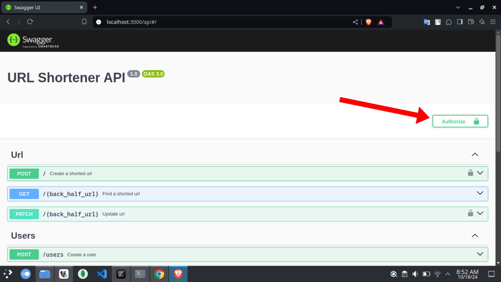

# Backend Developer Intern Code Test

## Project setup

```bash
$ docker compose up -d
```
This command will create 2 containers, namely the database and the NestJS application.

## Start and stop the project

```bash
$ docker compose start

$ docker compose stop
```

## Run tests

```bash
# unit tests
$ yarn run test

# test coverage
$ yarn run test:cov
```

## Usage

After the project is running you can visit http://localhost:3000/api to enter the swagger UI

### Authentication
To include authentication, you can enter a token (generated when logging in) in the Authorize section


